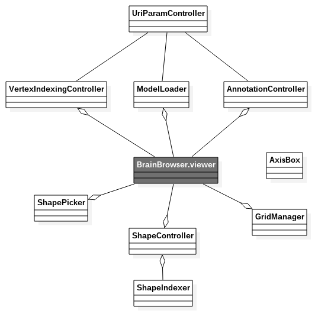

# About this class diagram

Note that the file `class.mdj` was created with [StarUML2](http://staruml.io/) and is an attempt of class diagram of BrainBrowser Surface UI (and only IU, not the core).

The element `BrainBrowser.viewer` is reprensented in dark grey because it is part of the core and not part of the UI, thus it is not implemented here.
