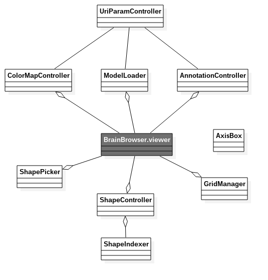

# BrainBrowser Surface UI

## Background history
Historically, **BrainBrowser** (and in particular the *Surface* module) was thought as a library, independant of all kind of UI element. This allowed a high level of abstraction and to develop the core without being too much concerned about the ergonomics. When the core eventually reached a decent stage of development and became richer in term of features, few web projects were build around the core to show the community what BrainBrowser was capable of. So far, this projects were distributed along with the core source, in the `examples` subfolder. In parallel, other larger and more mature projects started to use the core of BrainBrowser, not directly as a dependency, but though its Javascript/Ajax API. [Loris](http://mcin-cnim.ca/neuroimagingtechnologies/loris/) and [Cbrain](http://mcin-cnim.ca/neuroimagingtechnologies/cbrain/) are good examples of such use.

## Gathering features
Having several independant projects that all use the Suface module of BrainBrowser for specialized needs is a great thing. Though, after some brainstorming sessions, the development team decided to gather the main features (if not all) and to make them available under a unique project: **BrainBrowser Surface UI**.

## Impact
This project is the result of an important refactoring, thus, the users have to keep in mind a few things:
- It was a necessity to modify the core code and this is not backward compatible.
- For external projects that are using the API, this should still be working fine (to be tested more...)
- The core code is still independant from any kind of UI. We still stick to the phylosophy of strictly splitting UI and core.

## Possible evolution
**BrainBrowser Surface UI** implements the UI but not only. Few parts of it could actually be tranfered to the core since they not UI opiniated. This is mainly the case for features like annotation management, grid and axes creation or even tuning some settings using URL arguments. This transfer work will be done progressively.

## features
TODO

## UI software architecture
Here is a an attempt of simplified class diagram to show the different classes and their relations:  

Keep in mind that JS that do properly allow to develop with *classes*, here we actually use objects and *prototypes*.

HERE you will find a documentation of each class. (TODO)
